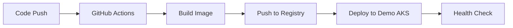
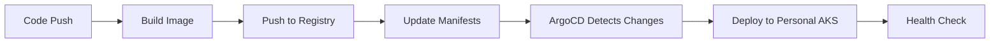

# 🚀 LinkOps CD Strategy: Demo vs. Personal AKS Deployments

This project demonstrates a flexible Continuous Deployment strategy using **two isolated AKS environments** — one for demo/interview scenarios, and one for full GitOps production workflows.

---

## 🧭 Overview

| Environment | Cluster | CD Method | Purpose |
|-------------|---------|-----------|---------|
| `demo`      | `linkops-demo-aks`      | GitHub Actions (Direct Helm Deploy) | Fast, live CI/CD for demos or interviews |
| `personal`  | `linkops-personal-aks`  | ArgoCD (GitOps Pull-Based)          | Full production-style GitOps platform |

---

## 🔹 Demo Deployment (CI/CD via GitHub Actions)

### ✅ Flow

1. Code pushed to `main` in [LinkOps-MLOps](https://github.com/jimjrxieb/LinkOps-MLOps)
2. GitHub Actions:
   - Authenticates to Azure via OIDC
   - Builds Docker image
   - Pushes to GitHub Container Registry
   - Deploys to `linkops-demo-aks` via Helm

### 📁 File: `.github/workflows/deploy-aks.yml`

```yaml
name: Deploy to AKS

on:
  push:
    branches: [ main ]
    paths:
      - 'shadows/**'
      - 'helm/**'
      - '.github/workflows/deploy-aks.yml'
  workflow_dispatch:
    inputs:
      environment:
        description: 'Environment to deploy to'
        required: true
        default: 'demo'
        type: choice
        options:
          - demo
          - personal

jobs:
  deploy-demo:
    needs: build-and-push
    runs-on: ubuntu-latest
    if: github.event.inputs.environment == 'demo' || (github.event.inputs.environment == '' && github.ref == 'refs/heads/main')
    environment: demo
    steps:
      - name: Log in to Azure (OIDC)
        uses: azure/login@v1
        with:
          client-id: ${{ secrets.AZURE_CLIENT_ID }}
          tenant-id: ${{ secrets.AZURE_TENANT_ID }}
          subscription-id: ${{ secrets.AZURE_SUBSCRIPTION_ID }}

      - name: Get AKS Credentials
        run: |
          az aks get-credentials \
            --resource-group linkops-demo-rg \
            --name linkops-demo-aks \
            --overwrite-existing

      - name: Deploy Services to Demo
        run: |
          for service in whis james katie igris auditguard sanitizer scraperdash data_collector ficknury; do
            if [ -d "./helm/$service" ]; then
              helm upgrade --install $service-demo ./helm/$service \
                --set image.repository=${{ env.REGISTRY }}/${{ env.IMAGE_NAME }}-$service \
                --set image.tag=${{ github.sha }} \
                --namespace default \
                --create-namespace \
                --wait
            fi
          done
```

---

## 🔸 Personal Deployment (GitOps via ArgoCD)

### ✅ Flow

1. Docker image is pushed via LinkOps-MLOps CI
2. Helm charts or K8s manifests updated in LinkOps-Manifests
3. ArgoCD (installed in `linkops-personal-aks`) auto-syncs from main branch
4. ArgoCD applies updates to the AKS cluster

### 📁 ArgoCD App Definition Example

```yaml
apiVersion: argoproj.io/v1alpha1
kind: Application
metadata:
  name: linkops-app
  namespace: argocd
spec:
  project: default
  source:
    repoURL: https://github.com/jimjrxieb/LinkOps-Manifests
    path: helm/linkops-app
    targetRevision: main
    helm:
      valueFiles:
        - values.yaml
      parameters:
        - name: image.tag
          value: "latest"
  destination:
    server: https://kubernetes.default.svc
    namespace: default
  syncPolicy:
    automated:
      prune: true
      selfHeal: true
    syncOptions:
      - CreateNamespace=true
```

### 📁 LinkOps-Manifests Structure

```
LinkOps-Manifests/
├── helm/
│   ├── linkops-app/
│   │   ├── Chart.yaml
│   │   ├── values.yaml
│   │   └── templates/
│   │       ├── deployment.yaml
│   │       ├── service.yaml
│   │       └── ingress.yaml
│   └── monitoring/
│       ├── Chart.yaml
│       └── templates/
├── k8s/
│   ├── namespaces/
│   ├── configmaps/
│   └── secrets/
└── argocd/
    ├── applications/
    └── projects/
```

---

## 🔀 Switching Between Clusters

| Task | Action |
|------|--------|
| Use demo | `cd demo/terraform && terraform apply` |
| Use personal | `cd personal/terraform && terraform apply` |
| Update kubeconfig | `az aks get-credentials --resource-group <rg> --name <cluster>` |
| Switch ArgoCD target | Change `destination.server` or repo branch in Application manifest |

### Quick Commands

```bash
# Switch to demo cluster
az aks get-credentials --resource-group linkops-demo-rg --name linkops-demo-aks --overwrite-existing

# Switch to personal cluster
az aks get-credentials --resource-group linkops-personal-rg --name linkops-personal-aks --overwrite-existing

# Check current context
kubectl config current-context

# List contexts
kubectl config get-contexts
```

---

## 🧠 Why This Matters

This dual-CD setup shows you can:

- ✅ **Build real-world pipelines** using GitHub Actions
- ✅ **Use Helm** for direct deploys and GitOps for production
- ✅ **Separate concerns** between app and infrastructure repos
- ✅ **Scale easily** from demo to enterprise-ready
- ✅ **Demonstrate GitOps** principles in practice
- ✅ **Show interview skills** with both push and pull-based CD

---

## 🛠️ Repo Roles

| Repo | Purpose | CD Method |
|------|---------|-----------|
| **LinkOps-Arise** | Infrastructure: Terraform, AKS, monitoring, ArgoCD | Terraform |
| **LinkOps-MLOps** | App code, Helm charts, GitHub Actions | GitHub Actions |
| **LinkOps-Manifests** | GitOps-managed K8s manifests and Helm values for ArgoCD | ArgoCD |

### Repository Responsibilities

#### LinkOps-Arise (Infrastructure)
- AKS cluster provisioning
- ArgoCD installation and configuration
- Monitoring stack (Prometheus, Grafana)
- Network policies and security
- Terraform state management

#### LinkOps-MLOps (Application)
- Microservice code
- Docker image builds
- Helm chart definitions
- GitHub Actions workflows
- Security scanning and testing

#### LinkOps-Manifests (GitOps)
- Kubernetes manifests
- Helm values for different environments
- ArgoCD application definitions
- Configuration management
- Environment-specific settings

---

## 🔄 Deployment Workflows

### Demo Environment Workflow



### Personal Environment Workflow



---

## 🔐 Security & Authentication

### GitHub Actions (Demo)
- **OIDC Authentication**: Secure Azure authentication without secrets
- **Service Principal**: Minimal required permissions
- **Container Registry**: GitHub Container Registry with proper access controls

### ArgoCD (Personal)
- **Git-based**: All changes tracked in version control
- **RBAC**: Role-based access control for ArgoCD users
- **Secrets Management**: Kubernetes secrets or external secret managers

### Required Secrets

#### GitHub Repository Secrets
```bash
AZURE_CLIENT_ID=your-service-principal-client-id
AZURE_TENANT_ID=your-azure-tenant-id
AZURE_SUBSCRIPTION_ID=your-subscription-id
GITGUARDIAN_API_KEY=your-gitguardian-key
SONAR_TOKEN=your-sonarcloud-token
```

#### Azure Service Principal Permissions
```bash
# AKS Cluster User Role for both clusters
az role assignment create \
  --assignee YOUR_CLIENT_ID \
  --role "Azure Kubernetes Service Cluster User Role" \
  --scope /subscriptions/YOUR_SUB_ID/resourceGroups/linkops-demo-rg/providers/Microsoft.ContainerService/managedClusters/linkops-demo-aks

az role assignment create \
  --assignee YOUR_CLIENT_ID \
  --role "Azure Kubernetes Service Cluster User Role" \
  --scope /subscriptions/YOUR_SUB_ID/resourceGroups/linkops-personal-rg/providers/Microsoft.ContainerService/managedClusters/linkops-personal-aks
```

---

## 📊 Monitoring & Observability

### Demo Environment
- **GitHub Actions**: Built-in workflow monitoring
- **Azure Monitor**: AKS cluster metrics
- **Application Logs**: kubectl logs and Azure Log Analytics

### Personal Environment
- **ArgoCD UI**: Application sync status and health
- **Prometheus/Grafana**: Full monitoring stack
- **Git History**: All changes tracked in manifests repo

### Health Checks

```bash
# Demo Environment
kubectl get pods -n default
kubectl get services -n default
kubectl logs -f deployment/whis-demo -n default

# Personal Environment
kubectl get pods -n default
kubectl get applications -n argocd
argocd app sync linkops-app
```

---

## 🚀 Getting Started

### 1. Setup Infrastructure
```bash
# Deploy demo environment
cd LinkOps-Arise/demo/terraform
terraform init && terraform apply

# Deploy personal environment
cd LinkOps-Arise/personal/terraform
terraform init && terraform apply
```

### 2. Configure GitHub Actions
```bash
# Run setup script
cd LinkOps-MLOps
./scripts/setup-github-actions.sh
```

### 3. Setup ArgoCD
```bash
# Access ArgoCD UI
kubectl port-forward svc/argocd-server -n argocd 8080:443

# Get admin password
kubectl -n argocd get secret argocd-initial-admin-secret -o jsonpath="{.data.password}" | base64 -d
```

### 4. Create ArgoCD Application
```bash
# Apply application definition
kubectl apply -f LinkOps-Manifests/argocd/applications/linkops-app.yaml
```

---

## 📌 Notes

- ✅ **ArgoCD should only target** `linkops-personal-aks`
- ✅ **GitHub Actions deploys only** to `linkops-demo-aks`
- ✅ **Secrets are stored securely** in GitHub → Settings → Secrets
- ✅ **Uses secure OIDC authentication**, no service principal passwords
- ✅ **Environment isolation** prevents cross-contamination
- ✅ **GitOps principles** demonstrated in personal environment
- ✅ **Traditional CI/CD** shown in demo environment

---

## 🎯 Benefits

### For Interviews
- **Demonstrates GitOps knowledge** with ArgoCD
- **Shows CI/CD expertise** with GitHub Actions
- **Proves infrastructure skills** with Terraform
- **Exhibits security awareness** with OIDC and RBAC

### For Production
- **Scalable architecture** from demo to enterprise
- **Security best practices** implemented
- **Monitoring and observability** built-in
- **Disaster recovery** with separate environments

### For Learning
- **Hands-on experience** with multiple CD patterns
- **Real-world scenarios** with actual cloud resources
- **Best practices** from industry standards
- **Troubleshooting skills** with real deployments

---

This dual-CD strategy provides a comprehensive demonstration of modern deployment practices, from simple CI/CD to enterprise GitOps, making it perfect for both learning and showcasing skills in interviews or production environments. 